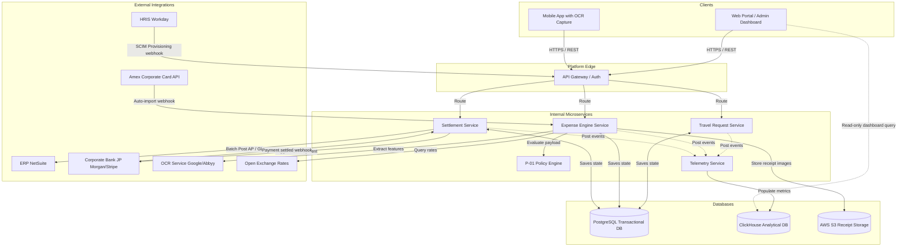

# Enterprise Employee Travel & Expense Management System
## Project Boundary & Architecture Blueprint

**Version:** 1.0  
**Status:** Architecture Design Ready  
**Based on:** TravelExpensePRD v1.0, TravelExpenseKPI v1.0, and project_scope.md  
**Date:** 2026-06-05  

---

## 1. Project Summary

The **Enterprise Employee Travel & Expense (T&E) Management System** is a unified, cloud-native platform designed to digitize and automate the lifecycle of corporate travel and expense workflows. The primary objective is to replace manual processes (spreadsheets, emails, paper receipts) with an automated, exception-driven pipeline. 

### Core Architecture Pillars

1. **Client Layer:**
   - **Employee Web Portal:** React/Next.js-based web app for creating travel requests, uploading expenses, checking reimbursement status, and viewing corporate travel policies.
   - **Mobile Application (iOS/Android):** React Native or native applications containing the custom offline-first receipt capture capability and high-speed OCR interface.
   - **Admin & Executive Dashboards:** Interactive visualization interface powered by Next.js and Tailwind CSS (or standard analytics engines) for CFO and operational leads.

2. **Backend Services (Microservices/Distributed Architecture):**
   - **Auth & Gateway Service:** Manages SSO integration (Okta/Azure AD), SCIM-based provisioning, RBAC, and rate limiting.
   - **Travel Request Service:** Controls User Story A1/A2 travel requests, cash advance workflows, manager budgets, and SLA/escalation triggers.
   - **Expense Engine Service:** Handles receipt metadata mapping, duplicate detection hashes, currency conversion integration (Open Exchange Rates), and corporate card transaction ingestion.
   - **P-01 Policy Engine:** Evaluates business rules (e.g., meal caps, booking tier constraints) with <350ms response latency, utilizing a horizontal scaling tier.
   - **Settlement & ERP Bridge Service:** Manages batch generation, ERP posting (NetSuite REST API), and corporate banking settlement (JP Morgan/Stripe).
   - **Telemetry & Reporting Service:** Real-time data pipeline feeding operational analytics databases and materializing metrics (KPIs 1–5).

3. **Data Layer:**
   - **Transactional Database:** PostgreSQL for transactional consistency (e.g., reports, lines, users, audit logs). Enforces Slowly Changing Dimensions (SCD Type 2) for employee hierarchies and policy configurations.
   - **Analytical Database / Read Replica:** ClickHouse or PostgreSQL Read Replica for dashboard queries to prevent performance degradation on write paths.
   - **Object Storage:** Secure AWS S3 bucket (or equivalent) for receipt image retention with strict access control.

---

## 2. Directory & Folder Structure Blueprint

This directory structure reflects the recommended multi-repo or monorepo layout for modularity, clean boundaries, separation of concerns, and ease of deployment.

```text
NeoVibe/
├── TravelExpensePRD/                 # Project documentation and specifications
│   ├── TravelExpensePRD.md          # Product Requirements Document (PRD)
│   ├── TravelExpenseKPI.md          # KPI Blueprint & Metrics Dictionary
│   ├── project_scope.md             # Project Scope and Scope Boundary
│   └── project_boundary.md          # Project Summary and Directory Structure (This file)
│
├── apps/                            # Client-facing applications
│   ├── web-portal/                  # Next.js web portal for employees and managers
│   │   ├── public/                  # Static assets and icons
│   │   └── src/
│   │       ├── components/          # Reusable UI components (buttons, inputs, cards, layout)
│   │       ├── features/            # Feature-specific modules (travel-requests, expenses, dashboard)
│   │       ├── hooks/               # Custom React hooks (authentication, network, queries)
│   │       ├── pages/               # Routing files (Next.js pages router or App router)
│   │       ├── services/            # Client API client integrations
│   │       └── styles/              # Global styles (Tailwind CSS, theme variables)
│   │
│   ├── admin-dashboard/             # Next.js application for CFO & Audit Lead views
│   │   └── src/
│   │       ├── components/          # Analytical charts, data tables, metrics grids
│   │       └── pages/               # CFO view, Finance Lead view, Settings pages
│   │
│   └── mobile-app/                  # React Native mobile application for iOS & Android
│       ├── android/                 # Native Android bridge code
│       ├── ios/                     # Native iOS bridge code
│       └── src/
│           ├── components/          # Native components, custom camera layout
│           ├── native-modules/      # Custom native bridges (offline SQLite database, image compressor)
│           ├── screens/             # Receipt capture, expense details, dashboard, settings
│           └── services/            # API integration, offline-sync scheduler
│
├── services/                        # Backend microservices
│   ├── api-gateway/                 # Gateway router, rate limiter, Okta/SSO validation
│   │
│   ├── travel-service/              # Manages travel requests, cash advances, budget validation
│   │   ├── src/
│   │   │   ├── controllers/         # API request handlers
│   │   │   ├── models/              # Travel request database schemas
│   │   │   ├── rules/               # SLA/Escalation 48-hour timers and managers
│   │   │   └── services/            # Internal business logic (HRIS validation, budget checks)
│   │   └── tests/                   # Unit and integration tests
│   │
│   ├── expense-service/             # Expense line item processing, receipt mapping, OCR broker
│   │   ├── src/
│   │   │   ├── ocr/                 # Google Document AI / Abbyy wrappers and accuracy engines
│   │   │   ├── exchange/            # Exchange rate broker (Open Exchange Rates client)
│   │   │   └── processing/          # Category mapping rules, duplicate detector hash algorithms
│   │   └── tests/
│   │
│   ├── policy-engine/               # P-01 High-throughput rule engine (<350ms p99 response)
│   │   ├── src/
│   │   │   ├── rules/               # Configurable rule registry (P-01-01 to P-01-05 implementation)
│   │   │   └── evaluator/           # Dynamic JSON rule runner, batch evaluator
│   │   └── tests/
│   │
│   ├── settlement-service/          # Batches approved items, manages ERP and Bank payloads
│   │   ├── src/
│   │   │   ├── erp-adapter/         # NetSuite REST API client (batch poster)
│   │   │   ├── bank-adapter/        # J.P. Morgan & Stripe ACH/wire payment interfaces
│   │   │   └── card-adapter/        # Amex Corporate Card reconciliation client
│   │   └── tests/
│   │
│   └── telemetry-service/           # KPI telemetry pipeline, real-time log ingestion, analytics
│       ├── src/
│       │   ├── pipeline/            # Event ingestion workers, DLQ triggers
│       │   └── aggregation/         # Rollup schedulers for daily/monthly dashboard tables
│       └── tests/
│
├── database/                        # Database migration scripts and schemas
│   ├── migrations/                  # Schema change control scripts
│   │   ├── transactional/           # Postgres migrations (users, travel, expenses, audits)
│   │   └── analytical/              # Analytical/ClickHouse schemas for metrics queries
│   └── seeds/                       # Seed scripts for testing environments (policy rule registries)
│
├── infrastructure/                  # Infrastructure as Code (IaC) and deployments
│   ├── docker/                      # Dockerfiles for each microservice
│   ├── helm/                        # Kubernetes Helm charts for orchestration (min 6 / max 30 pods)
│   └── terraform/                   # AWS cloud infra definition (DB, Kubernetes cluster, S3 bucket)
│
└── shared/                          # Shared libraries across client & server teams
    ├── dtos/                        # Common API Data Transfer Objects
    ├── types/                       # Shared Typescript types
    └── utils/                       # Hashing utils, date helpers, common validators
```

---

## 3. Boundary Definitions & Module Responsibilities

### `apps/web-portal` & `apps/mobile-app` (Client Boundary)
* **Responsibility:** Captures user intent. The mobile app owns physical image capture, image preprocessing, local caching (for offline use), and secure transmission. The web app serves as the desktop cockpit for travelers and managers.
* **Security boundary:** No direct database connections; communication must flow exclusively through `api-gateway` with bearer JWT tokens.

### `services/api-gateway` (Edge Boundary)
* **Responsibility:** Incoming requests ingress here. Authenticates user profiles with Azure AD/Okta, verifies active employment status via SCIM sync tables, enforces role-based rules, and rate-limits traffic to prevent API exhaustion.
* **Integrations:** Azure AD, Okta, SCIM directory.

### `services/travel-service` (Workflow Boundary)
* **Responsibility:** Tracks travel intents and validates them against budgets before expenses are ever run. It triggers async workflow events for manager actions and enforces the 48-hour SLA escalation.
* **Integrations:** Corporate Travel Desk booking system adapters.

### `services/expense-service` (Ingestion Boundary)
* **Responsibility:** Ingests receipts, OCR extractions, and corporate card statements. It executes the receipt duplicate detection hash algorithm and coordinates external calls to the OCR parser and Open Exchange Rates.
* **Integrations:** Google Document AI / Abbyy, Open Exchange Rates, Amex API.

### `services/policy-engine` (Logic Boundary)
* **Responsibility:** Acts as a pure, high-performance rule execution sandbox. It receives a structured payload representing an expense report, validates it against the active schema in under 350ms, and outputs a structured violation report.
* **Scale design:** Fully stateless; scales horizontally behind a private Kubernetes load balancer.

### `services/settlement-service` (Transaction Boundary)
* **Responsibility:** Translates approved financial state into actions. It manages batch pipelines, posts liabilities to the general ledger, routes cash payouts to corporate banking API gateways, and handles banking callback webhooks.
* **Integrations:** NetSuite REST API, J.P. Morgan Chase API, Stripe Connect.

### `services/telemetry-service` (Observation Boundary)
* **Responsibility:** Consumes audit events asynchronously (via a message broker like Kafka/RabbitMQ) and writes them to the analytical databases. It isolates dashboard operations from transactional systems.
* **Monitoring:** Watches dead-letter queues (DLQs) for webhook retries and records performance.

---

## 4. Integration Exchange Paths



---

*This document defines the architecture layout. Any additions of new services, repositories, or external endpoints must be registered here to maintain overall project boundary integrity.*
